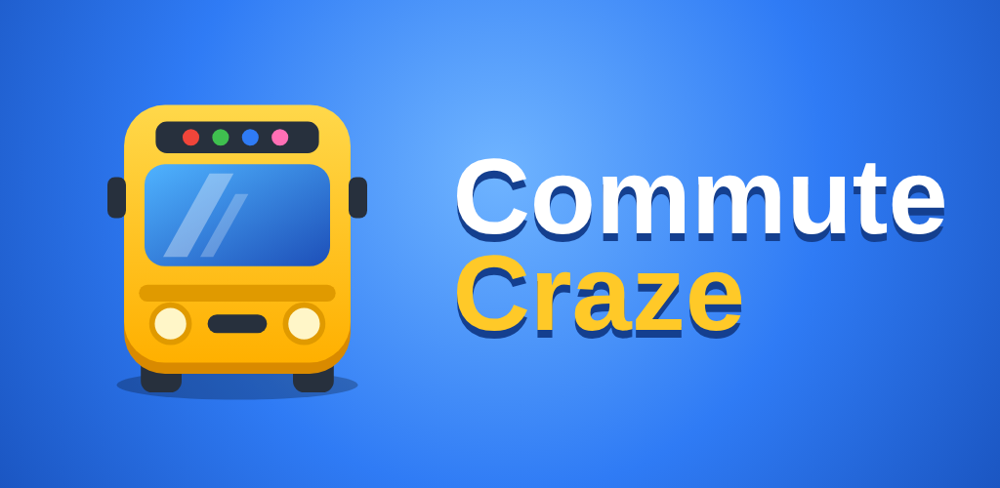

# Commute Craze 🚌

Renkli araçları otoparktan çıkar, yolcuları doğru renkteki araca bindir! (Bus Jam / Parking Jam türünde 3D bulmaca oyunu.)

## ⬇️ İndir (her zaman en son sürüm)

| Dosya | Ne için |
|---|---|
| [**CommuteCraze-TEST.apk**](https://github.com/mehmetyusuf112200-cmd/Public2/releases/latest/download/CommuteCraze-TEST.apk) | Telefona kurup test et |
| [**CommuteCraze-PlayStore.aab**](https://github.com/mehmetyusuf112200-cmd/Public2/releases/latest/download/CommuteCraze-PlayStore.aab) | Play Console'a yükle |
| [Tüm sürümler](https://github.com/mehmetyusuf112200-cmd/Public2/releases) | Eski sürümler |

Bu linkler hiç değişmez: koda her değişiklik gönderildiğinde GitHub oyunu otomatik derler ve yeni sürümü buraya koyar (~5 dk). Derlemeyi elle başlatmak için: **Actions → Android build → Run workflow**.

## 🏪 Play Store malzemeleri
- Açıklamalar, veri güvenliği ve içerik derecelendirme cevapları: [store/PLAY-STORE-METINLERI.md](store/PLAY-STORE-METINLERI.md)
- Ekran görüntüleri: [store/ekran-goruntuleri](store/ekran-goruntuleri)
- Tanıtım görseli 1024×500 ve ikon 512×512: [store](store)
- Gizlilik politikası: https://mehmetyusuf112200-cmd.github.io/commute-craze-privacy.html

## 🔑 İmzalı AAB için GitHub Secrets (bir kerelik)
**Settings → Secrets and variables → Actions → New repository secret** ile şu 4 secret eklenir (değerler ayrı gönderilen *GITHUB-SECRETS.txt* dosyasında):

| Ad | Değer |
|---|---|
| `KEYSTORE_BASE64` | dosyadaki uzun metin |
| `KEYSTORE_PASSWORD` | şifre |
| `KEY_ALIAS` | `upload` |
| `KEY_PASSWORD` | şifre (aynı) |

Secrets yoksa AAB yine üretilir ama imzasız olur (sürüm notunda ⚠️ yazar). **Anahtar dosyası bu repoya asla konmaz** (repo herkese açık).

## 💰 Reklamlar (AdMob)
Şu an Google'ın **test** reklamları açık. Gerçek reklamlar için ID'ler `src/config.js` ve `android/app/src/main/res/values/strings.xml` içine yazılıp `testing: false` yapılır.

## 🛒 Uygulama içi satın almalar (Play Console → Para kazanma → Uygulama içi ürünler)
Bu ID'lerle ürün oluşturulur (fiyatı sen belirlersin, oyun fiyatı Play'den otomatik çeker):

| Ürün ID | Ne verir | Tür |
|---|---|---|
| `remove_ads` | Reklamsız | tek seferlik |
| `starter_pack` | Reklamsız + 3.000 altın + her güçlendiriciden 5 | tek seferlik |
| `coins_small` | 2.000 altın | tüketilebilir |
| `coins_medium` | 6.500 altın | tüketilebilir |
| `coins_large` | 16.000 altın | tüketilebilir |
| `booster_bundle` | Her güçlendiriciden 5 | tüketilebilir |

## 🏆 Liderlik tablosu (Google Play Games)
Play Console → Play Games Services → kurulum: proje kimliği `strings.xml` → `game_services_project_id`, "En Yüksek Bölüm" liderlik tablosunun ID'si `src/config.js` → `GAMES.leaderboardId`. (Manifest'teki yorum satırı da açılır.)

## 🛠️ Kod yapısı
- `src/core/logic.js` – oyun kuralları + çözülebilirliği garantili bölüm üretici (sonsuz bölüm)
- `src/render.js` – Three.js 3D görünüm ve animasyonlar
- `src/main.js` – arayüz, güçlendiriciler, ekonomi, kayıt
- `src/config.js` – reklam ID'leri ve ekonomi ayarları
- `android/` – Capacitor Android projesi (targetSdk 36)
- `tests/levels.test.js` – ilk 500 bölümün çözülebilirlik testi (her derlemede çalışır)

Yerelde: `npm ci && npm run dev` (tarayıcıda oynanır), `npm test`.
